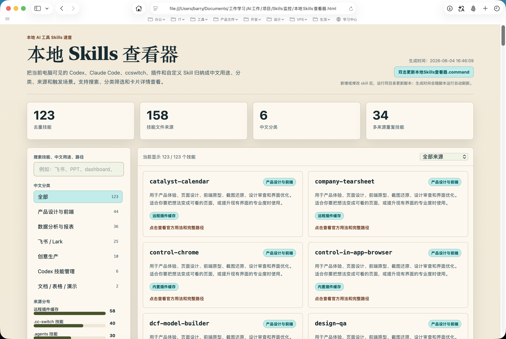
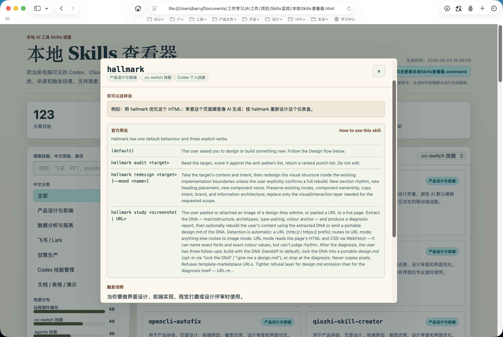

# Local Skills Viewer Builder Skill

一个可转发给其他 AI agent 的方法论 Skill。下载后，把 `skill/SKILL.md` 交给 Codex、Claude Code、OpenClaw、ccswitch 或其他支持本地技能/规则文件的 agent，它就能按文档在用户自己的电脑上生成“本地 Skills 查看器”。

This repository contains a methodology skill for AI agents. After downloading it, give `skill/SKILL.md` to Codex, Claude Code, OpenClaw, ccswitch, or another local agent. The agent should follow the instructions to generate a local HTML skills viewer on the user's own machine.

## 效果预览 / Preview

总览页面 / Overview:



详情弹窗 / Detail modal:



## 这个仓库是什么 / What This Repo Is

这是一个 **Skill 教程包**，不是已经生成好的查看器项目。

它的目标是让其他人的 agent 不用重新摸索这些逻辑：

- 本机 skill 文件应该怎么扫描
- Codex / Claude Code / ccswitch / OpenClaw / 自定义目录应该怎么兼容
- `SKILL.md` 的 name、description、官方用法应该怎么解析
- 如何生成可直接打开的单文件 HTML
- 如何生成本机更新脚本
- 如何避免写死某个人电脑上的路径

This is a **skill tutorial package**, not the generated viewer app itself.

The skill tells an agent how to:

- discover local skill folders
- support Codex / Claude Code / ccswitch / OpenClaw / custom roots
- parse `SKILL.md` metadata and official usage sections
- generate a browser-openable single-file HTML viewer
- create a local update script
- avoid hardcoding another user's machine paths

## 下载后怎么用 / How To Use After Download

### 方式 1：直接让 agent 读取这个 Skill

下载仓库后，把下面这句话发给你的 agent：

```text
请读取这个文件并按它的规范执行：skill/SKILL.md
我要在我的电脑上生成一个本地 Skills 查看器。
```

Then ask your agent:

```text
Read and follow this file: skill/SKILL.md
Generate a local skills viewer on my machine.
```

### 方式 2：安装到本地 skills 目录

如果你的 agent 支持本地 skills，可以把整个 `skill/` 文件夹复制到对应目录，并命名为 `local-skills-viewer-builder`。

示例：

```text
local-skills-viewer-builder/
└── SKILL.md
```

常见安装位置只是参考，不要盲目套用：

```text
~/.codex/skills/local-skills-viewer-builder/SKILL.md
~/.agents/skills/local-skills-viewer-builder/SKILL.md
~/.cc-switch/skills/local-skills-viewer-builder/SKILL.md
```

Windows、OpenClaw 或团队自定义环境，请按你的 agent 文档选择技能目录。

If your agent supports local skills, copy the `skill/` folder into that agent's skill directory and name it `local-skills-viewer-builder`.

## 推荐提示词 / Recommended Prompt

中文：

```text
使用 local-skills-viewer-builder skill。
请先识别我的系统、可用运行时和本机 skill 目录，然后在当前目录生成一个本地 Skills 查看器。
要求：
1. 生成单文件 HTML，可直接用浏览器打开。
2. 生成适合我系统的一键更新脚本。
3. 支持搜索、中文分类筛选、来源筛选和详情弹窗。
4. 提取每个 skill 的官方用法说明。
5. 不要修改任何原始 skill 文件。
6. 不要写死别人的电脑路径。
```

English:

```text
Use the local-skills-viewer-builder skill.
First detect my OS, available runtime, and local skill folders. Then generate a local skills viewer in the current directory.
Requirements:
1. Generate a single HTML file that opens directly in a browser.
2. Generate a one-click update script for my OS.
3. Support search, Chinese category filters, source filters, and detail modals.
4. Extract the official usage section for each skill.
5. Do not modify any original skill files.
6. Do not hardcode paths from someone else's machine.
```

## 仓库内容 / Repository Contents

```text
skill/SKILL.md                  # 可安装、可转发的方法论 skill
assets/viewer-overview.png       # 查看器总览截图
assets/viewer-detail-modal.png   # 查看器详情弹窗截图
README.md                       # 使用教程
```

## Agent 执行后应该生成什么 / Expected Agent Output

执行这个 skill 后，agent 应该在用户选择的项目目录里生成类似这些文件：

```text
generate_skill_dashboard.py        # 或等效生成脚本
本地Skills查看器.html                # 可直接打开的单文件 HTML
tokens.css                         # 可选样式 tokens
更新本地Skills查看器.command          # macOS 示例；Windows/Linux 应生成对应脚本
```

具体文件名和脚本格式应根据用户系统调整。

## 关键原则 / Core Principle

这个 skill 不是让大家复制某一台电脑上的成品，而是让 agent 按同一套方法在不同用户的机器上重新生成查看器。

The skill is not for copying one machine's finished project. It is for guiding an agent to recreate the viewer correctly on each user's own machine.
